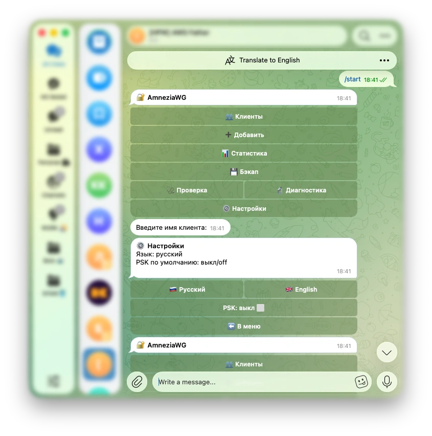

# awgram

[🇷🇺 Русский](README.md) · 🇬🇧 English

[](https://github.com/ekuraev/awgram/actions/workflows/ci.yml)
[](https://github.com/ekuraev/awgram/releases)
[](LICENSE)

A Rust Telegram bot for managing [AmneziaWG](https://amnezia.org/) clients
straight from your phone: add/remove a client, view the list and traffic —
no SSH required.

<p align="center">
  
</p>

**awgram manages native AmneziaWG** — the Linux kernel module (set up by the
[installer](https://github.com/bivlked/amneziawg-installer)) — entirely from
Telegram: once installed, no console or terminal is ever needed. Native AWG
is noticeably faster and lighter than container-based setups — especially
tangible on budget VPS hosts.

## Features

- ➕ **Add a client**: expiry (1d–365d presets or custom), PSK, duplicate
  guard with recreate; you get back a `.conf` file, a QR code and an import
  link.
- 👥 **Client list**: status, ↓/↑ traffic, ⏳ expiry badge; client card,
  config re-delivery, deletion with confirmation.
- 🔄 **Config re-issue**: one client or all at once (optionally with route
  reset).
- 📊 **Stats**: total clients, active, aggregate traffic.
- 💾 **Backup/restore** of the AmneziaWG state, archive download to chat.
- 🩺 **Server check** and 🔬 **environment diagnostics**.
- ⚙️ **Settings**: RU/EN language (per admin), default PSK, client name
  ID prefix; everything survives restarts (persistent state).
- 🔒 **Security**: access restricted to `admin_ids`, shell-free manage-script
  invocation, secrets never reach the logs, hardened mode (dedicated user +
  sudoers).

## Quick start

1. Get a bot token from [@BotFather](https://t.me/BotFather) (`/newbot`)
   and your numeric ID from [@userinfobot](https://t.me/userinfobot).
2. On a VPS with the
   [AmneziaWG installer](https://github.com/bivlked/amneziawg-installer) set up, run:

   ```bash
   curl -fsSL https://github.com/ekuraev/awgram/releases/latest/download/install.sh | bash
   ```

3. Answer the installer's questions (language, root/hardened mode, token,
   admin IDs) — done: open your bot in Telegram and press `/start`.

Fully automated install — via flags:

```bash
curl -fsSL https://github.com/ekuraev/awgram/releases/latest/download/install.sh \
  | bash -s -- install --lang en --mode root --token 'TOKEN' --admins 111111111 --yes
```

You can skip the `--token` flag (so the token never lands in `argv` or shell
history) — `export AWGRAM_TOKEN='TOKEN'` before the same command without
`--token` instead.

Post-install management: `awgram-setup update | config | status | uninstall`.

## How it works

`awgram` is a single static binary (Rust, `teloxide`, long polling, no
webhook) living on the same VPS as the VPN. It never touches the AmneziaWG
configuration directly — it invokes the standard `manage_amneziawg.sh`
script (shell-free, with `--json`) and renders the result as an inline
Telegram menu. Access is restricted to `admin_ids`; the token and
`.conf`/QR contents never reach the logs.

## AmneziaWG installer compatibility

The bot is a layer on top of `manage_amneziawg.sh` from
[bivlked/amneziawg-installer](https://github.com/bivlked/amneziawg-installer)
and depends directly on its interface.

- **Supported installer version:
  [v5.20.0](https://github.com/bivlked/amneziawg-installer/releases/tag/v5.20.0)**
  (tested against it; newer versions are at your own risk until this line is
  updated).
- Subcommands used: `add`, `remove`, `list`, `stats`, `regen`, `backup`,
  `restore`, `check`, `diagnose` — all with `--json`.

## Building from source

You need a stable Rust toolchain and `cargo`; TLS is rustls-based, no system
`libssl` required.

```bash
cargo build --release                 # target/release/awgram
./scripts/build-musl.sh [arm64|all]   # static Linux binaries in dist/ (requires Docker)
```

Releases on a `v*` tag build amd64+arm64 binaries with `sha256` checksums
automatically.

## License

[MIT](LICENSE)
