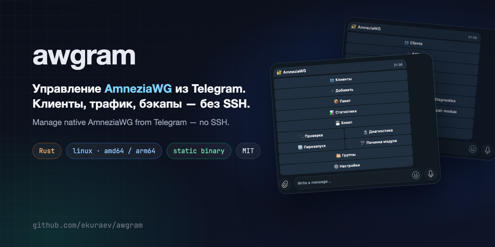

# awgram

[🇷🇺 Русский](README.md) · 🇬🇧 English

[](https://github.com/ekuraev/awgram/actions/workflows/ci.yml)
[](https://github.com/ekuraev/awgram/releases/latest)
[](https://github.com/ekuraev/awgram/releases)
[](https://github.com/ekuraev/awgram/discussions)
<br>
[](https://github.com/ekuraev/awgram/releases/latest)
[](Cargo.toml)
[](docs/compat.en.md)
[](LICENSE)

A Rust Telegram bot for managing [AmneziaWG](https://amnezia.org/) clients
straight from your phone: add/remove a client, view the list and traffic —
no SSH required.

<p align="center">
  
</p>

https://github.com/user-attachments/assets/35af60f4-c7d8-44d5-9c90-bcd06b20c864

**awgram manages native AmneziaWG** — the Linux kernel module (set up by the
[installer](https://github.com/bivlked/amneziawg-installer)) — entirely from
Telegram: once installed, no console or terminal is ever needed. Native AWG
is noticeably faster and lighter than container-based setups — especially
tangible on budget VPS hosts.

## Features

### Clients

- ➕ **Add**: expiry (1d–365d presets or custom), PSK, duplicate guard with
  recreate; you get back a `.conf`, a QR and an import link.
- 👥 **List**: three-color status (🟢 online / 🟡 no handshake / 🔴 offline)
  with last-handshake time right in the button, ↓/↑ traffic, ⏳ expiry badge;
  status filter and "online-first" sorting; client card, deletion with
  confirmation; menus, lists, prompts and operation results all live in one
  message — the chat never piles up duplicates.
- 🔗 **AllowedIPs from presets** — at creation, in bulk creation and when
  editing a client: RFC 1918 local networks and typical home-router /24s, the
  VPN subnet, a full tunnel or your own CIDR list; you can also keep the
  server's routing mode. The "exclude from VPN" mode sends everything through
  the tunnel except the marked networks, so the client stays reachable on its
  LAN. When the
  installer supports `add --allowed-ips`, the routes are set by the same call
  that creates the client, otherwise by a separate edit right after it.
- ⚙️ **Modify client parameters**: Keepalive, DNS, AllowedIPs, Endpoint.
- 🔄 **Config re-issue**: one client or all at once (optionally with route
  reset).
- 📊 **Detailed traffic stats**: today / 7 days / 30 days, trends, top
  clients — a dedicated SQLite store, data survives reboots.
- 📜 **History** of connections and operations for every client.
- 🟢 **Honest online status**: online only when the handshake is under
  5 minutes old.
- 📦 **Bulk generation** — create up to 10 clients at once by prefix
  (`user-01 … user-10`) in a single action, delivering configs as an album.
- 🎛️ **Delivery filter** — configure which artifacts (`.conf` / QR / link)
  are automatically sent after creation.
- 🧩 **Per-artifact delivery** — from the client card you can request config,
  QR, link, or all of them separately.

### Groups & delegation

- 🗂️ **Client groups**: create, rename, delete; move clients between
  groups and re-issue all configs of a group at once.
- 🤝 **Delegation**: group admins see and manage only their own group;
  assigned via a one-time invite link (24 h TTL) or by user ID.
- 📏 **Quotas**: per-group client limit — applies to group admins (the
  owner is unlimited).

### Server

- 🩺 **Check**: card with service, interface, port, module, clients and
  firewall status (✅/⚠️/❌).
- 🔬 **Environment diagnostics**.
- 🔁 **Restart service** and 🛠 **kernel module repair** (DKMS rebuild).
- 💾 **Backups**: scheduled with rotation and reports, comments and
  pinning, restore AmneziaWG and, optionally, the bot's own database
  (groups, stats), backup download as a file. Hardened-mode caveats and
  manual restore are covered in [docs/operations.en.md](docs/operations.en.md).

### Settings & security

- ⚙️ **Settings**: RU/EN language (per admin), default PSK, client name
  ID prefix; everything survives restarts (persistent state).
- 🔒 **Security**: access restricted to owners from `admin_ids` and the
  group admins they appoint, shell-free manage-script invocation, secrets
  never reach the logs, hardened mode (dedicated user + sudoers).
- 🧦 **Proxy to Telegram**: a priority list of `socks5`/`socks5h`/`http`/
  `https` proxies in `telegram_proxies` with automatic failover — for
  servers where the Bot API is unreachable directly; details and the
  routing-based alternative in [docs/proxy.en.md](docs/proxy.en.md).

## Requirements

- A Linux VPS on amd64 or arm64 with systemd; root or sudo during install.
- Native AmneziaWG set up by
  [bivlked/amneziawg-installer](https://github.com/bivlked/amneziawg-installer)
  v5.21.0 or newer (verified against v5.31.0, see
  [docs/compat.en.md](docs/compat.en.md)).
- A bot token from [@BotFather](https://t.me/BotFather) and the numeric
  Telegram IDs of the administrators.
- Access from the server to `api.telegram.org` — directly or via a proxy
  ([docs/proxy.en.md](docs/proxy.en.md)).

## Quick start

1. Get a bot token from [@BotFather](https://t.me/BotFather) (`/newbot`)
   and your numeric ID from [@userinfobot](https://t.me/userinfobot).
2. On a VPS with the
   [AmneziaWG installer](https://github.com/bivlked/amneziawg-installer) set up, run:

   ```bash
   curl -fsSL https://github.com/ekuraev/awgram/releases/latest/download/install.sh | bash
   ```

3. Answer the installer's questions (language, root/hardened mode, token,
   admin IDs) — done: open your bot in Telegram and press `/start`.

Fully automated install — via flags:

```bash
curl -fsSL https://github.com/ekuraev/awgram/releases/latest/download/install.sh \
  | bash -s -- install --lang en --mode root --token 'TOKEN' --admins 111111111 --yes
```

You can skip the `--token` flag (so the token never lands in `argv` or shell
history) — `export AWGRAM_TOKEN='TOKEN'` before the same command without
`--token` instead.

Post-install management: `awgram-setup update | config | status | uninstall`.
Pre-release builds: `awgram-setup update --channel rc`; update channels are
described in [docs/operations.en.md](docs/operations.en.md#update-channels).

## How it works

`awgram` is a single static binary (Rust, `teloxide`, long polling, no
webhook) living on the same VPS as the VPN. It never touches the AmneziaWG
configuration directly — it invokes the standard `manage_amneziawg.sh`
script (shell-free, with `--json`) and renders the result as an inline
Telegram menu. Access is restricted to owners from `admin_ids` and the
group admins they appoint; the token and `.conf`/QR contents never reach
the logs.

## AmneziaWG installer compatibility

The bot is a layer on top of `manage_amneziawg.sh` from
[bivlked/amneziawg-installer](https://github.com/bivlked/amneziawg-installer)
and depends directly on its `--json` interface.

- **Supported version — [v5.31.0](https://github.com/bivlked/amneziawg-installer/releases/tag/v5.31.0)**
  (`--json` contract verified), minimum —
  [v5.21.0](https://github.com/bivlked/amneziawg-installer/releases/tag/v5.21.0).
- Subcommands: `add`, `remove`, `list`, `stats`, `regen`, `modify`, `backup`,
  `restore`, `check`, `restart`, `repair-module` — all with `--json`.
- The optional `add --allowed-ips` is detected from the script's help rather
  than its version; without it the `add` + `modify` path is used.

What changed in each installer release and how it affected the bot — in
[docs/compat.en.md](docs/compat.en.md).

## Building from source

You need a stable Rust toolchain (1.95 or newer) and `cargo`; TLS is
rustls-based, no system `libssl` required.

```bash
cargo build --release                 # target/release/awgram
./scripts/build-musl.sh [arm64|all]   # static Linux binaries in dist/ (requires Docker)
```

Releases on a `v*` tag build amd64+arm64 binaries with `sha256` checksums
automatically.

## Community

- 💬 Questions and discussion — [Discussions](https://github.com/ekuraev/awgram/discussions).
- 🐞 Bugs and ideas — [Issues](https://github.com/ekuraev/awgram/issues/new/choose)
  via the templates; roadmap — [open proposals](https://github.com/ekuraev/awgram/issues?q=is%3Aissue+is%3Aopen+label%3Aenhancement).
- 🔐 Vulnerabilities — privately, per [SECURITY.md](SECURITY.md).
- 🤝 Contributing — [CONTRIBUTING.md](CONTRIBUTING.md); change history —
  [CHANGELOG.md](CHANGELOG.md).

## Acknowledgements

- [bivlked/amneziawg-installer](https://github.com/bivlked/amneziawg-installer) —
  the installer and `manage_amneziawg.sh` the bot builds upon.
- [Amnezia](https://amnezia.org/) — for AmneziaWG.
- [teloxide](https://github.com/teloxide/teloxide) — Telegram Bot API in Rust.

## License

[MIT](LICENSE)
