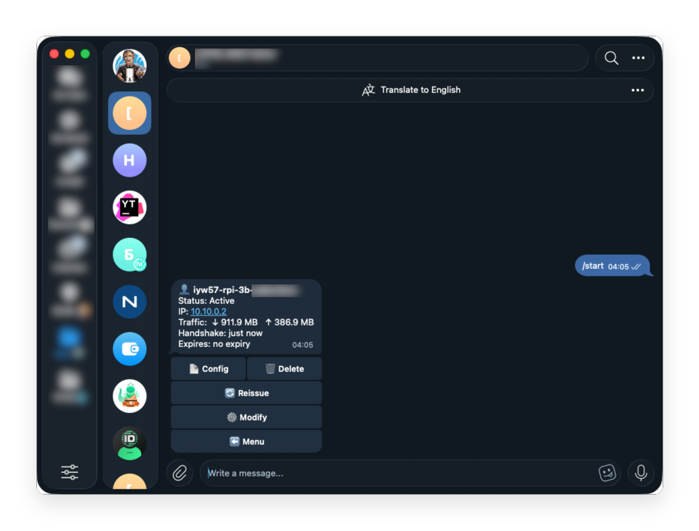

# awgram

🇷🇺 Русский · [🇬🇧 English](README.en.md)

[](https://github.com/ekuraev/awgram/actions/workflows/ci.yml)
[](https://github.com/ekuraev/awgram/releases)
[](LICENSE)

Telegram-бот на Rust для управления клиентами [AmneziaWG](https://amnezia.org/) прямо
с телефона: добавить/удалить клиента, посмотреть список и трафик — без SSH.

<p align="center">
  
</p>

**awgram управляет нативным AmneziaWG** — kernel-модулем для Linux
(ставится [инсталлером](https://github.com/bivlked/amneziawg-installer)) —
целиком из Telegram: после установки не нужны ни консоль, ни терминал.
Нативный AWG заметно быстрее и экономнее контейнерных решений — особенно
это ощутимо на недорогих VPS.

## Возможности

### Клиенты

- ➕ **Добавление**: срок (пресеты 1д–365д или свой), PSK, защита от
  дубликатов с пересозданием; в ответ — `.conf`, QR и ссылка импорта.
- 👥 **Список**: трёхцветный статус (🟢 онлайн / 🟡 без handshake / 🔴 оффлайн)
  и время последнего handshake прямо в кнопке, трафик ↓/↑, метка ⏳ срока;
  фильтр по статусу и сортировка «онлайн вперёд»; карточка клиента,
  удаление с подтверждением; меню, списки, вопросы и результаты операций
  живут в одном сообщении — чат не копит дубли.
- 🔗 **AllowedIPs готовыми пресетами** — при создании, массовой генерации и
  правке клиента: локальные сети RFC 1918, подсеть VPN, полный туннель или
  свой список CIDR; можно оставить режим маршрутизации сервера. Если инсталлер
  умеет `add --allowed-ips`, маршруты ставятся одной командой вместе с
  созданием, иначе — отдельной правкой сразу после него.
- ⚙️ **Изменение параметров** клиента: Keepalive, DNS, AllowedIPs, Endpoint.
- 🔄 **Перевыпуск конфигов**: одного или всех сразу (опционально — со сбросом
  маршрутов).
- 📊 **Детальная статистика трафика**: сегодня / 7 дней / 30 дней, тренды,
  топ клиентов — собственное SQLite-хранилище, данные переживают ребуты.
- 📜 **История** подключений и операций по каждому клиенту.
- 🟢 **Честный онлайн-статус**: онлайн только при handshake младше 5 минут.
- 📦 **Массовая генерация** — создание до 10 клиентов за раз по префиксу
  (`user-01 … user-10`) одним действием, с выдачей конфигов альбомом.
- 🎛️ **Фильтр выдачи** — настройка, какие артефакты (`.conf` / QR / ссылка)
  автоматически выдаются после создания.
- 🧩 **Поартефактная выдача** — из карточки клиента можно запросить конфиг,
  QR, ссылку или всё сразу по отдельности.

### Группы и делегирование

- 🗂️ **Группы клиентов**: создание, переименование, удаление; перенос
  клиентов между группами и массовый перевыпуск конфигов группы.
- 🤝 **Делегирование**: групповые админы видят и управляют только своей
  группой; назначение — одноразовой инвайт-ссылкой (TTL 24 ч) или
  по user ID.
- 📏 **Квоты**: лимит числа клиентов на группу — действует на групповых
  админов (владелец без ограничений).

### Сервер

- 🩺 **Проверка**: карточка со статусом сервиса, интерфейса, порта, модуля,
  клиентов и фаервола (✅/⚠️/❌).
- 🔬 **Диагностика окружения**.
- 🔁 **Перезапуск сервиса** и 🛠 **починка модуля ядра** (DKMS rebuild).
- 💾 **Бэкапы**: по расписанию с ротацией и отчётами, комментарии
  и закрепление, восстановление AmneziaWG и, по желанию, БД бота
  (группы, статистика), загрузка бэкапа файлом.

### Настройки и безопасность

- ⚙️ **Настройки**: язык RU/EN (у каждого админа свой), PSK по умолчанию,
  ID-префикс имён клиентов; всё переживает рестарт (персистентный state).
- 🔒 **Безопасность**: доступ только для владельцев из `admin_ids` и
  назначенных ими групповых админов, вызов manage-скрипта без shell,
  секреты не попадают в логи, hardened-режим (отдельный пользователь +
  sudoers).
- 🧦 **Прокси до Telegram**: приоритетный список `socks5`/`socks5h`/`http`/
  `https` в `telegram_proxies` с автофейловером — для серверов, где Bot API
  напрямую недоступен; подробности и альтернатива через маршрутизацию —
  в [docs/proxy.md](docs/proxy.md).

В hardened-режиме архивы самого инсталлера создаются с `chmod 600` и
пользователю `awgram` недоступны; бэкапы через бота работают в
root-режиме, в hardened — после ручного `chmod 640`/ACL на
`backups/*.tar.gz` или обновления инсталлера. Ручное восстановление
из бандла бота, если сам бот недоступен:

```bash
tar -xzf awgram_backup_<ts>.tar.gz awg/ \
  && sudo bash manage_amneziawg.sh restore awg/awg_backup_<ts>.tar.gz
```

## Быстрый старт

1. Получите токен бота у [@BotFather](https://t.me/BotFather) (`/newbot`)
   и свой числовой ID у [@userinfobot](https://t.me/userinfobot).
2. На VPS с установленным
   [AmneziaWG-инсталлером](https://github.com/bivlked/amneziawg-installer) выполните:

   ```bash
   curl -fsSL https://github.com/ekuraev/awgram/releases/latest/download/install.sh | bash
   ```

3. Ответьте на вопросы установщика (язык, режим root/hardened, токен,
   ID админов) — готово: откройте бота в Telegram и нажмите `/start`.

Полностью автоматическая установка — флагами:

```bash
curl -fsSL https://github.com/ekuraev/awgram/releases/latest/download/install.sh \
  | bash -s -- install --lang ru --mode root --token 'ТОКЕН' --admins 111111111 --yes
```

Токен можно не передавать флагом (тогда он не попадёт ни в `argv`, ни в
историю шелла) — вместо этого `export AWGRAM_TOKEN='ТОКЕН'` перед той же
командой без `--token`.

Управление после установки: `awgram-setup update | config | status | uninstall`.

Предрелизные сборки — доступны начиная с **v0.7.0**: `awgram-setup update
--channel rc` (выбор запоминается, канал rc видит и стабильные релизы;
вернуться — `awgram-setup update --channel stable`). Если на сервере
`awgram-setup` старше v0.7.0, флага `--channel` у него ещё нет — либо
выполните обычный `awgram-setup update` (он обновит и сам скрипт), либо
поставьте rc сразу однострочником из нужного релиза:

```bash
curl -fsSL https://github.com/ekuraev/awgram/releases/download/vX.Y.Z-rc.N/install.sh \
  | bash -s -- update --channel rc
```

## Как это работает

`awgram` — один статический бинарник (Rust, `teloxide`, long polling, без
webhook), который живёт на том же VPS, что и VPN. Конфигурацию AmneziaWG он
не трогает — вызывает штатный скрипт `manage_amneziawg.sh` (без shell, с
флагом `--json`) и рендерит результат в inline-меню Telegram. Доступ
ограничен владельцами из `admin_ids` и назначенными ими групповыми
админами; токен и содержимое `.conf`/QR никогда не попадают в логи.

## Совместимость с инсталлером AmneziaWG

Бот — надстройка над `manage_amneziawg.sh` из
[bivlked/amneziawg-installer](https://github.com/bivlked/amneziawg-installer)
и напрямую зависит от его интерфейса.

- **Поддерживаемая версия инсталлера:
  [v5.31.0](https://github.com/bivlked/amneziawg-installer/releases/tag/v5.31.0)**
  (сверен `--json`-контракт). Минимальная —
  [v5.21.0](https://github.com/bivlked/amneziawg-installer/releases/tag/v5.21.0);
  более старые v5.20.x не поддерживаются — бот использует расширенный
  `--json`-интерфейс команд управления, появившийся в v5.21.0.
  v5.21.1–v5.31.0 JSON-контракт не ломали: v5.21.1/v5.21.2 — багфиксы
  валидации, v5.22.0 добавил в `regen`/`check` предупреждение о рассинхроне
  `awgsetup_cfg.init` (уходит в stderr, stdout-JSON не затронут),
  v5.23.0 — изменения только в установщике (модуль ядра на старых ядрах),
  v5.24.0 добавил аддитивное поле `module.version` в `check --json`,
  v5.25.0 — только новые предупреждения, и все они уходят в stderr,
  v5.26.0 — только каскадный скрипт маршрутизации и диагностический отчёт,
  v5.27.0 — только установщик (согласие на удаление пакетов),
  v5.27.1 поменял `manage_amneziawg.sh`: `modify`/`regen` нормализуют
  списки `AllowedIPs`/`DNS` к виду «a, b, c», `regen` больше не схлопывает
  их; конверты не тронуты — `value` в ответе `modify` остаётся присланным
  значением, новые сообщения уходят в stderr, а бот и так шлёт списки
  в каноническом виде; v5.28.0–v5.29.0 — только установщик (защита
  загрузочных пакетов при обновлении системы, маскирование ключей
  в диагностическом отчёте), подписи релизов и документация —
  в `manage_amneziawg.sh` сменился лишь номер версии;
  v5.30.0 ограничил все обращения к интерфейсу таймаутом и перестал
  выдавать непрочитанное состояние за измеренное — `list --json` при
  неудачном чтении оставляет клиентам `no_data` вместо «нет handshake»
  (бот этот статус понимает и красит жёлтым), а `check --json` отдаёт
  пустой `interface.addresses`, на что бот реагирует штатно: пресет
  подсети VPN не показывается, массовая генерация сообщает о недоступной
  ёмкости; v5.31.0 определяет полный туннель покрытием маршрутов, поэтому
  дефолтный режим «Amnezia» получает `::/0`, а `modify` предупреждает,
  если ему передали полный туннель без `::/0` — бот в пресете «весь
  трафик» шлёт `0.0.0.0/0, ::/0`, так что предупреждение не срабатывает.
  Все новые сообщения обоих релизов уходят в stderr, конверты `--json`
  не изменились.
- Используемые подкоманды: `add`, `remove`, `list`, `stats`, `regen`,
  `modify`, `backup`, `restore`, `check`, `restart`, `repair-module` —
  все с `--json`.
- **Необязательный `add --allowed-ips`**
  ([Issue #253](https://github.com/bivlked/amneziawg-installer/issues/253))
  — индивидуальные маршруты клиента одной командой вместе с созданием. Бот
  определяет наличие флага по справке самого скрипта (`--help`, ничего не
  меняет), а не по номеру версии: релиз с флагом заранее не известен, а на
  полуобновлённом сервере номер и реальность расходятся. Нет флага — работает
  прежний путь `add` + `modify`, минимальная версия не меняется. У массовой
  генерации отката нет: там `modify` пришлось бы звать на каждого клиента,
  поэтому без флага шаг маршрутов не показывается.

## Сборка из исходников

Нужен стабильный Rust не ниже 1.95 и `cargo`; TLS — на rustls, системный
`libssl` не нужен.

```bash
cargo build --release                 # target/release/awgram
./scripts/build-musl.sh [arm64|all]   # статические Linux-бинарники в dist/ (нужен Docker)
```

Релизы на тег `v*` собирают бинарники amd64+arm64 c `sha256`-суммами
автоматически.

## Лицензия

[MIT](LICENSE)
